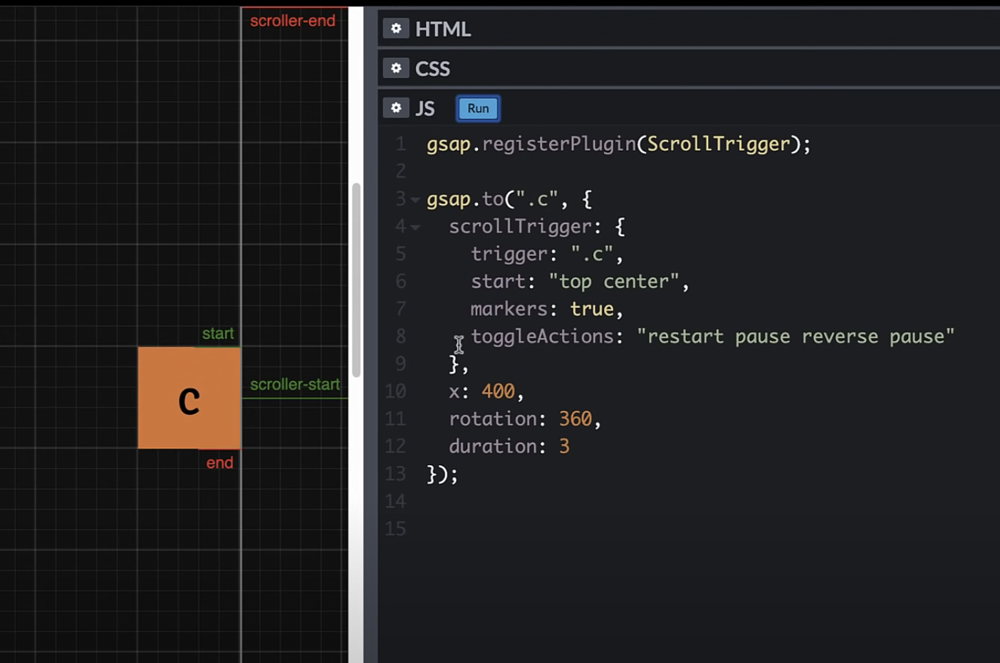

🙏🏻 https://youtu.be/X7IBa7vZjmo 강의를 바탕으로 작성한 글입니다.

회사 홈페이지를 맡게 되면서 GSAP에 대해 관심이 생겼다. 이전 프로젝트에는 CSS를 활용해서 애니메이션을 구현했다. CSS로 해결할 수 있으면 최대한 CSS를 사용하는게 좋다는 글을 어디선가 봤다. 하지만 CSS는 한계가 있어 더 멋진 애니메이션을 구현하고 싶다면 이 라이브러리에 대해 공부하면 좋을 것 같다.

# GSAP?

GSAP(GreenSock Animation Platform)란, GreenSock에서 만든 자바스크립트 애니메이션 라이브러리이다. GSAP는 제이쿼리보다 20배 이상 퍼포먼스가 좋고 사용법도 간단하다지만, 사용법은 어렵고 헷갈리는 것 같다. 그럼에도 GSAP를 사용하는 이유는
- 대부분 상을 받은 사이트가 사용하며
- 구글리 추천하는 자바스크립트 애니메이션
- 1000만 이상이 사용하는 라이브러리
로 커뮤니티가 형성되어있기 때문이다.

설치는 아래 github에서 CDN이나 NPM으로 설치할 수 있다.

[GSPA github](https://github.com/greensock/GSAP)

# gsap.to

대상과 속성이 필수적으로 필요하다. target이 x좌표 400만큼 360도 3초동안 이동한다는 표현하고 싶다면 다음과 같이 작성하면 된다.

```js
gsap.to('.target', {
  x: 400,
  rotation: 360,
  duration: 3 //default는 0.5s
})
```

랜더링되자마자 애니매이션이 실행되어 target이 아래에 있으면 애니매이션을 보지 못한다.

```js
gsap.registerPlugin(ScrollTrigger);

gsap.to('.target', {
  scrollTrigger: '.target',
  x: 400,
  rotation: 360,
  duration: 3
})
```

scrollTrigger를 걸어주면 target이 화면에 보일 때, 애니매이션이 시작된다. 하지만 반대로 스크롤을 올렸을 때 애니매이션이 재동작한다거나 거꾸로 돌아가지는 않는다.

사용 가능한 프로퍼티 : https://greensock.com/docs/v3/GSAP/gsap.to()

# gsap.from(), fromTo(), set()

- from()은 정반대로 되돌아오는 애니매이션이 실행
- fromTo()sms from 속성이 시작값으로 세팅, to 속성이 종료값으로 세팅되어 애니매이션 효과가 나타난다.
- set()은 애니메이션 효과 없이 즉시 변경된다.

# ScrollTrigger
## ▪️ Toggle actions

Toggle 액션을 사용한다면 가능하다. scrollTrigger에 객체를 만들어주고, trigger와 toggleActions을 만들어 준다. 
- when it enters the viewport
- when it leaves
- when scrolled back into view
- when it leaves again (scrolled all the way back)
4가지의 toggle points마다 8가지의 액션(:paly, pause, resume, reverse, restart, reset, complete, none)을 지정할 수 있다.

```js
gsap.registerPlugin(ScrollTrigger);

gsap.to('.target', {
  scrollTrigger: {
    trigger: '.target',
    toggleActions: 'restart pause reverse pause', //toggle points
  },
  x: 400,
  rotation: 360,
  duration: 3
})
```

## ▪️ 'start' and 'end'
애니매이션이 시작하고 끝나는 지점을 설정할 수 있다. 첫번째는 해당 컴포넌트 기준, 두번째는 viewport 기준이다. top, center, bottem, pixels, percentages(relative to top)를 사용할 수 있다.

ex) `start: '20px 80%'`

```js
gsap.registerPlugin(ScrollTrigger);

gsap.to('.target', {
  scrollTrigger: {
    trigger: '.target',
    start: 'top center', //target의 top과 viewport의 center가 만날 때 시작
    endTrigger: '.secondTarget',
    end: 'bottom 100px', //target의 bottom과 viewport의 100px 위치가 만날 때 끝
    marker: true,
    toggleActions: 'restart pause reverse pause',
  },
  x: 400,
  rotation: 360,
  duration: 3
})
```
 `marker: true`를 사용한다면, 직접 trigger의 위치를 볼 수 있다.
    



target에 다른 컴포넌트가 들어갈 수 있고, trigger와 endTrigger에 각각 다른 컴포넌트로 설정할 수 있다.

## ▪️ Scrub animations

스크롤에 걸려 애니매이션이 움직인다고 생각하면 편하다. start지점에 들어서자마자 스크롤에 갈고리처럼 걸려서 움직임에 따라 애니매이션이 움직인다.

```js
gsap.registerPlugin(ScrollTrigger);

gsap.to('.target', {
  scrollTrigger: {
    trigger: '.target',
    start: 'top center',
    end: 'bottom 100px',
    scrub: true, //숫자로 준다면 그만큼 delay가 된다. 1이면 default보다 조금 늦게 적용
    marker: true,
  },
  x: 400,
  rotation: 360,
  ease: 'none',
  duration: 3
})
```

이미지를 순차적으로 실행하기 위해 타임라인을 지정해 사용할 수도 있다. 각각 delay를 지정하는 비효율적인 작업을 줄여준다.

```js
gsap.registerPlugin(ScrollTrigger);

let tl = gsap.timeline({
  scrollTrigger: {
    trigger: '.target',
    start: 'top center',
    end: 'bottom 100px',
    scrub: true,
    marker: true,
  },
})

tl.to('.target', {
  x: 400,
  rotation: 360,
  ease: 'none',
  duration: 3
})
.to('.target', {
  backgroundColor: 'red',
  duration: 1
})
```

## ▪️ Pinning

start되는 순간 화면이 고정되어 애니매이션이 실행되게끔 설정할 수 있다. 가끔 어떤 사이트를 보면 화면이 중간에 멈춰 슬라이드가 움직이고, 사진이 움직이는 것을 볼 수 있다. 그런 경우 사용한다.

```js
gsap.registerPlugin(ScrollTrigger);

gsap.to('.target', {
  scrollTrigger: {
    trigger: '.target',
    start: 'top center',
    end: 'bottom 100px',
    scrub: true, //숫자로 준다면 그만큼 delay가 된다. 1이면 default보다 조금 늦게 적용
    marker: true,
    pin: true, //컴포넌트를 지정하면 해당 컴포넌트가 start~end까지 움직이지 않는다.
  },
  x: 400,
  rotation: 360,
  ease: 'none',
  duration: 3
})
```

ex.
```js
gsap.registerPlugin(ScrollTrigger);
gsap.defaults({ease: 'none', duration: 2});

const tl = gsap.timeline();
tl.from('.first', {xPercent: -100})
  .from('.second', {xPercent: 100})
  .from('.third', {yPercent: -100});

ScrollTigger.create({
  animation: tl,
  trigger: '#container',
  start: 'top top',
  end: '+=4000',
  scrub: true,
  pin: true,
  anticipatePin: 1
})
```

## ▪️ Snapping

위에서 언급했던 슬라이드를 구현할 수 있는 방법이다. 스크롤에 따라 움직이며, snap이 있을 시 스크롤이 중간에 멈춰있다며 자동으로 그만큼 움직이는 것이다. 살짝만 움직여도 자동으로 슬라이드가 움직이는 것을 볼 수 있다. 부드럽게 움직이는 효과를 낼 수 있다.

```js
gsap.registerPlugin(ScrollTrigger);

let section = gsap.utils.toArray('.panel');

gsap.to(section, {
  xPercent: -100 * (sections.length - 1),
  ease: 'none',
  scrollTrigger: {
    trigger: '.container',
    pin: true,
    scrub: 1,
    snap: 1 / (sections.length -1),
    end: () => "+=" + document.querySelector('.container').offsetWidth
  },
})
```

## ▪️ Callbacks and Custom Options

- onEnter: () => console.log('enter')
- onLeave: () => console.log('leave')
- onEnterBack: () => console.log('enterBack')
- onLeaveBack: () => console.log('leaveBack')
- onUpdata: (self) => console.log('update', self.progress.toFixed(3))
- onToggle: (self) => console.log('toggled', self.isActive))
- toggleClass: 'active'
- id: 'my-id'
- scroller: '#container'
- horizontal: true

ex.
```js
gsap.registerPlugin(ScrollTrigger);

scrollTrigger.create({
  trigger: '.target',
  start: 'top center',
  end: 'top 100px',
  onEnter: () => console.log('enter'),
  onLeave: () => console.log('leave'),
  marker: true,
})
```

---
참고
- https://youtu.be/X7IBa7vZjmo
- https://greensock.com/why-gsap/
- https://lpla.tistory.com/106

```toc
```