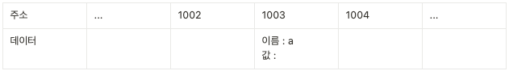
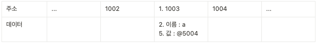
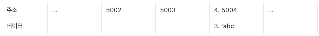

이 글은 [코어 자바스크립트](http://www.yes24.com/Product/Goods/78586788) 책을 읽고, 공부하고 정리하는 목적으로 사용합니다. 자바스크립트에 대한 블로깅을 무엇으로 남길까 고민하다, 자바스크립트를 공부하는 데엔 이만한 책이 없다고 생각하여 2회독을 돌리며, 정리하고 있습니다.

## 1-1 데이터 타입의 종류

기본형(원시형) - primitive type
- number
- string
- boolean
- null
- undefined
- Symbol

참조형 - reference type
- Object
    - Array
    - Function
    - Data
    - RegExp
    - Set, WeakSet, Map, WeakMap

## 1-2 데이터 타입에 관한 배경지식
### 1-2-1 메모리와 데이터

| 0 | 1 | 0 | 1 | 1 | 0 | 0 | 1 |
| --- | --- | --- | --- | --- | --- | --- | --- |
- 컴퓨터는 모든 데이터를 0 또는 1로 바꿔 기억한다.
- 하나의 메모리 조각을 '비트(bit)'라고 한다.
- 각 비트는 고유한 식별자를 통해 위치를 확인할 수 있다.
- 비트 단위로 위치를 확인하는 것은 비효율적이다. 
- 따라서, 8개의 비트를 1바이트(byte) 단위로 묶어 검색 시간을 줄인다. 
- 1비트마다 0 또는 1의 두 가지 값을 표현할 수 있으므로 1바이트는 총 256(2^8)개의 값을 표현할 수 있다.
- 비트와 마찬가지로 바이트 역시 시작하는 비트의 식별자로 위치를 파악할 수 있다.
- 모든 데이터는 바이트 단위의 식별자, 더 정확하게는 메모리 주솟값(memory address)을 통해 서로 연결할 수 있다.

### 1-2-2 식별자와 변수

- 변수 : 변할 수 있는 데이터
- 식별자(변수명) : 어떤 데이터를 식별하는 데 사용하는 이름

## 1-3 변수 선언과 데이터 할당
### 1-3-1 변수 선언

변수 : 변경 가능한 데이터가 담길 수 있는 공간 또는 그릇, 이 공간에서 숫자를 담았다가 문자열을 담는 등의 다양한 명령을 내릴 수 있다.

```jsx
var a;
```



명령을 받은 컴퓨터는 메모리에서 비어있는 공간 하나를 확보한다. 임의로 1003번 공간의 이름(식별자)을 a라고 지정한다. 여기까지가 **변수 선언 과정**이다. 이후 사용자가 a에 접근하고자 하면 컴퓨터는 메모리에서 a라는 이름을 가진 주소를 검색해 공간에 담긴 데이터를 반환할 것이다.

### 1-3-2 데이터 할당

```jsx
var a;        //변수 a 선언
a = 'abc';    //변수 a에 데이터 할당

var = 'abc';  //변수 선언과 할당을 한 문장으로 표현
```

메모리에서 비어있는 공간을 확보하고 그 공간의 이름을 설정하는 것은 선언 과정, a라는 이름을 가진 주소를 검색해서 그곳에 문자열 'abc'를 할당하는 것이 **할당 과정**이다.

하지만 실제로는 해당 위치에 문자열 'abc'를 직접 저장하지 않는다. 데이터를 저장하기 위한 별도의 메모리 공간을 다시 확보해 문자열 'abc'를 저장하고, 그 주소를 변수 영역에 저장하는 식으로 이루어 진다.

**변수 영역**



**데이터 영역**



왜 변수 영역에 값을 직접 대입하지 않고 굳이 번거롭게 한 단계를 더 거치는 걸까?

- 이는 데이터 변환을 자유롭게 할 수 있게함과 동시에 메모리를 더욱 효율적으로 관리하기 위한 고민의 결과이다.
- 자바스크립트는 숫바혈 데이터에 대한 64비트의 공간을 확보하지만 문자열은 정해진 규격이 없다.
- 한 글자마다 영어는 1바이트, 한글은 2바이트 등 각 필요한 메모리가 가변적이다. 따라서 전체 글자 수 역시 가변적이기 때문에 '확보된 공간을 변환된 데이터 크기에 맞게 늘리는 작업'이 선행되는 번거로움이 생길 것이다.
- 결국 효율적으로 문자열 데이터의 변환을 처리하려면 변수와 데이터를 별도의 공간에 나누어 저장하는 것이 최적이다.
- EX. 'abc' + 'def' 라면 문자열을 새로 만들어 별도의 공간에 저장하고 그 주소를 변수 공간에 연결한다. 문자열 제거도 마찬가지다. 기존 문자열에 어떤 변환을 가하든 상관 없이 무조건 새로 만들어 별도의 공간에 저장한다.
- 이처럼 변수 영역과 데이터 영역을 분리하면 중복된 데이터에 대한 처리 효율이 높아진다.

## 1-4 기본형 데이터와 참조형 데이터
### 1-4-1 불변값

- 바꿀 수 있으면 변수, 바꿀 수 없으면 상수
- 변경 가능성의 대상은 변수 영역 메모리
- 한 번 데이터 할당이 이뤄진 변수 공간에 다른 데이터를 재할당할 수 있는지 여부가 관건이다. 반면 불변성 여부를 구분할 때의 변경 가능성의 대상은 데이터 영역 메모리이다.
- 기본형 데이터인 숫자, 문자열, boolean, null, undefined, Symbol은 모두 불변값이다.
- 기존에 저장된 메모리 자체를 바꾸는 것이 아니라 기존에 저장했던 메모리를 찾아 있으면 재활용하고, 없으면 새로 만들어서 저장한다.
- 변경은 새로 만드는 동작을 통해서만 이뤄진다. 이것이 바로 불변값의 성질이다. 한 번 만들어진 값은 가비지 컬렉팅을 당하지 않는 한 영원히 변하지 않는다.

### 1-4-2 가변값

- 기본형 데이터와의 차이는 '객체의 변수(프로퍼티) 영역'이 별도로 존재한다는 점이다.
- '데이터 영역'은 기존의 메모리 공간을 그대로 활용하고 있다. 데이터 영역에 저장된 값은 모두 불변값이다. 그러나 변수에는 다른 값을 얼마든지 대입할 수 있다.
- 참조형 데이터는 불변하지 않다(가변값이다)라고 하는 것이다.
- 💡 가비지 컬렉터(garbage collector, GC) : 런타임 환경에 따라 특정 시점이나 메모리 사용량이 포화 상태에 임박할 때마다 자동으로 수거 대상들을 수거한다. 수거된 메모리는 다시 새로운 값을 할당할 수 있는 빈 공간이 된다. (어떤 데이터에 대해 자신의 주소를 참조하는 변수의 개수인 참조카운트가 0인 메모리 주소는 카비지 컬렉터의 수거 대상이 된다.)

### 1-4-3 변수 복사 비교

- 변수를 복사하는 과정은 기본형 데이터와 참조형 데이터 모두 같은 주소를 바라보게 되는 점에서 동일하다.
- 복사 과정은 동일하지만 데이터 할당 과정에서 이미 차이가 있기 때문에 변수 복사 이후의 동작에도 큰 차이가 발생한다.
- 기본형 데이터를 복사한 변수의 값을 바꾸면 값이 달라지는 반면, 참조형 데이터를 복사한 변수의 프로퍼티 값을 바꾸니 값은 바뀌지 않았다. 즉, 기본형 데이터는 서로 다른 주소를 바라보게 되었으나, 참조형 데이터는 여전히 같은 객체를 바라보고 있는 상태이다.
- '기본형은 값을 복사하고 참조형은 주솟값을 복사한다'고 설명하고 있지만, 사실은 어떤 데이터 타입이든 변수에 할당하기 위해서는 주솟값을 복사해야 하기 때문에, 엄밀히 따지만 모든 데이터 타입은 참조형 데이터일 수 밖에 없다.
- 기본형은 주솟값을 복사하는 과정이 한 번만 이뤄지고, 참조형은 한 단계를 더 거치게 된다는 차이가 있다.
- 새로운 객체를 할당하면 값을 직접 변경했으므로 새로운 공간에 새 객체가 저장되고 그 주소를 변수 영역에 저장하게 된다.
- 즉, 참조형 데이터가 '가변값'이라고 설명할 때의 '가변'은 참조형 데이터 자체를 변경할 경우가 아니라 그 내부의 프로퍼티를 변경할 때만 성립한다.

## 1-5 불변 객체
### 1-5-1 불변 객체를 만드는 간단한 방법

- 참조형 데이터의 '가변'은 데이터 자체가 아닌 내부 프로퍼티를 변경할 때만 성립한다. 데이터 자체를 변경하고자 하면(새 데이터 할당) 기본형 데이터와 마찬가지로 기존 데이터는 변하지 않는다.
- 내부 프로터티를 변경할 필요학 있을 때마다 매번 새로운 객체를 만들어 재할당하거나, 자동 새 객체 만들는 도구를 사용한다면 객체도 불변성을 확보할 수 있을 것이다.
- 값으로 전달받은 객체에 변경을 가하더라도 원본 객체를 변하지 않아야 하는 경우에 필요하다.

```jsx
var user = {
	name : 'siyoon',
	age : '20'
};

var changeName = function (user, newName) {
	return {
		name : newName,
		age : user.age
	};
};
```

- 위의 코드는 정보가 많을수록 번거로운 작업이 늘어난다. 대상 객체의 프로퍼티 개수에 상관 없이 모든 프로퍼티를 복사하는 함수를 만드는 방법이 더 좋을 것이다.

```jsx
//얕은 복사
var copyObject = function (target) {
	var result = {};
	for (var prop in target) {
		result[prop] = target[prop];
	};
	return result;
};
```

### 1-5-2 얕은 복사와 깊은 복사

- 얕은 복사 (shallow copy) : 바로 아래 단계의 값만 복사하는 방법, 중첩된 객체에서 참조형 데이터가 저장된 프로퍼티를 복사할 때 그 주솟값만 복사한다는 의미이다. 해당 프로퍼티에 대해 원본과 사본이 모두 동일한 참조형 데이터의 주소를 가리키게 된다. 사본을 바꾸면 원본도 바뀌고, 원본을 바꾸면 사본도 바뀐다.
- 깊은 복사 (deep copy) : 내부의 모든 값들을 하나하나 찾아서 전부 복사하는 방법
- 어떤 객체를 복사할 때 객체 내부의 모든 값을 복사해서 완전히 새로운 데이터를 만들고자 할 때, 객체의 프로퍼티 중에서 그 값이 기본형 데이터링 경우에는 그대로 복사하면 되지만 참조형 데이터는 다시 그 내부의 프로퍼티들을 복사해야한다. 이 과정을 참조형 데이터가 있을 때마다 재귀적으로 수행해야만 비로소 깊은 복사가 되는 것이다.

```jsx
//깊은 복사
var copyObjectDeep = function (target) {
	var result = {};
	if (typeof target === 'object' && target !== null) { //typeof null === object 에러에 대비
		for (var prop in target) {
			result[prop] = copyObjectDeep(target[prop]);
		};
	} else {
		result = target;
	}
	return result;
};
```

- 이 함수는 원본과 사본이 서로 완전히 다른 객체를 참조하게 되어 어느 쪽의 프로퍼티를 변경하더라도 다른 쪽에 영향을 주지 않는다.
- hasOwnProperty로 상속된 프로퍼티를 복사하지 않게 하는 방법, JSON 문법으로 문자열로 전환했다가 다시 JSON 객체로 바꾸는 방법 등도 존재한다. 단, JSON은 함수 외 순수한 정보를 다룰 때만 활용하기 좋은 방법이다.

## 1-6 undefined 와 null
- undefined : 사용자가 명시적으로 지정할 수도 있지만 값이 존재하지 않을 때 자바스크립트 엔진이 자동으로 부여하는 경우도 있다.
    - 값을 대입하지 않은 변수, 즉 데이터 영역의 메모리 주소를 지정하지 않은 식별자에 접근할 때
    - 객체 내부의 존재하지 않는 프로퍼티에 접근하려고 할 때
    - return 문이 없거나 호출되지 않는 함수의 실행 결과
- '비어있는 요소'와 'undefined를 할당항 요소'는 출력 결과부터 다르다. '비어있는 요소'는 순회와 관련된 많은 배열 메서드들의 순회 대상에서 제외된다.
- undefined는 그 자체로 값이다.
- null : 같은 의미의 '비어있음', 사용자가 직접 대입할 때는 undefined 대신 null을 사용하자.

```toc
```